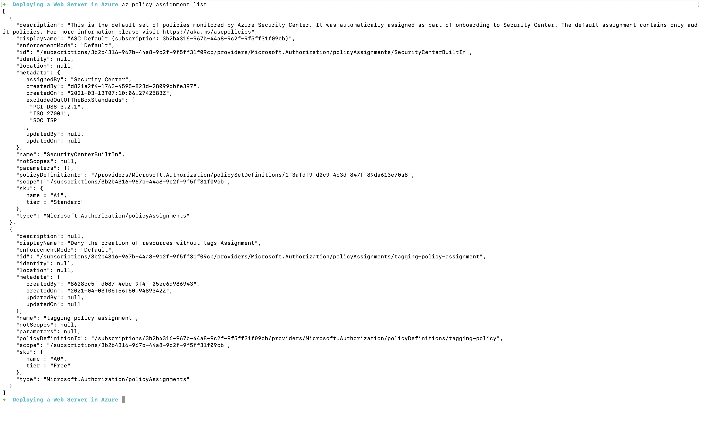
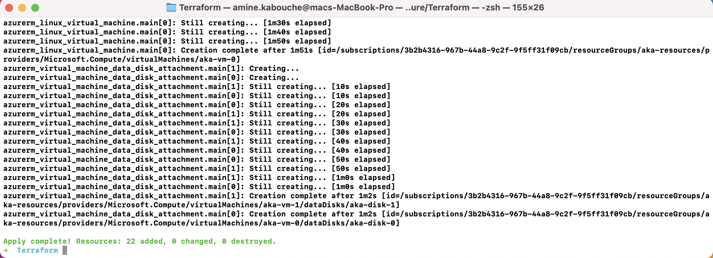
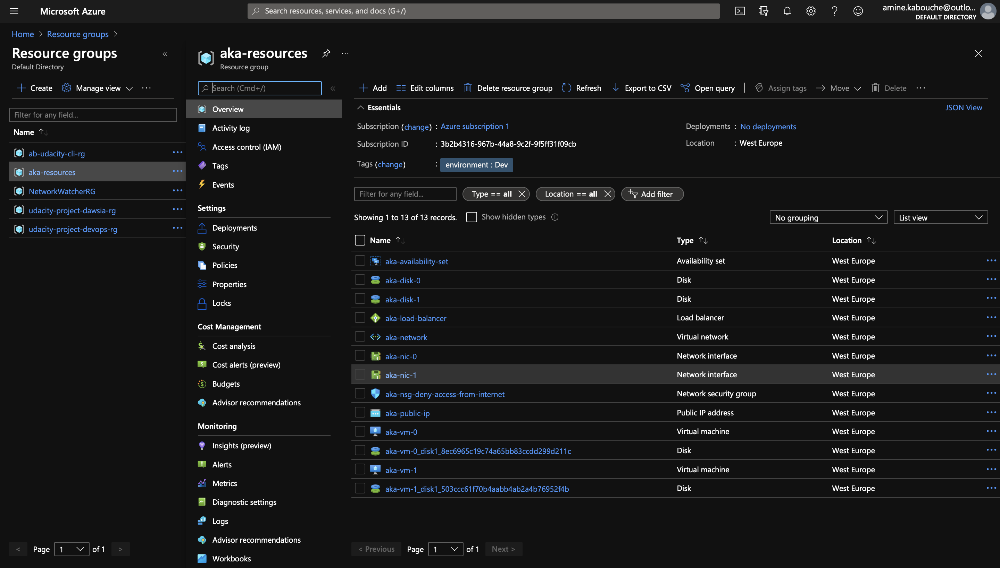
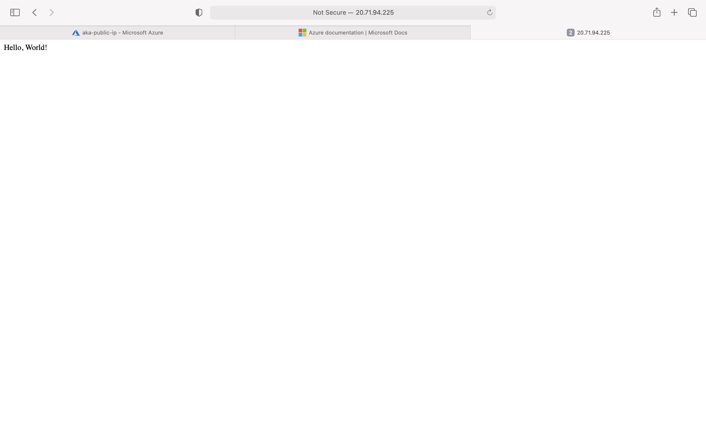

# Azure Infrastructure Operations Project: Deploying a scalable IaaS web server in Azure

### Introduction
This project combines the power of Packer, Terraform and Azure to deploy a customizable and scalable web server in Azure.

### Getting Started
This project combines Packer, Terraform 
1. Clone this repository
2. Deploy azure policy
3. Deploy packer image
4. Deploy the infrastructure with terraform 

### Dependencies
1. Create an [Azure Account](https://portal.azure.com) 
2. Install the [Azure command line interface](https://docs.microsoft.com/en-us/cli/azure/install-azure-cli?view=azure-cli-latest)
3. Install [Packer](https://www.packer.io/downloads)
4. Install [Terraform](https://www.terraform.io/downloads.html)

### Instructions
1. Login to azure account using the CLI:
    ``` bash
    az login 
    ```
2. Create an azure policy and a new assignment for it: 
    ``` bash
    az policy definition create --name tagging-policy --display-name 'Deny the creation of resources without tags' --rules TaggingPolicy.json --mode Indexed

    az policy assignment create --name tagging-policy-assignment --display-name 'Deny the creation of resources without tags Assignment' --policy tagging-policy
    ```
3. Create a service principle for Packer and Terraform:
    ``` bash
    az ad sp create-for-rbac --query "{ client_id: appId, client_secret: password, tenant_id: tenant }"
    ```
4. Create a resource group for packer image:
    ``` bash
    az group create -n udacity-project-dawsia-rg -l eastus
    ```
5. Create and deploy a Packer image:
    ``` bash
    packer validate server.json
    packer build server.json
    ```
6. Customizing the Terraform template: The Terraform template is composed of two files:
   - [vars.tf](vars.tf) file: contains all the variables that help you customize the template such as:
     - prefix: the prefix for all the resoures
     - vmcount: the number of VMs to be spinned
     - packer-image-name: the name of the created image with packer
     - ...
   - [main.tf](main.tf) file: contains the definition of the infrastructure to be created such as:
     - Resource group
     - Virtual network
     - Public IP
     - Network security group
     - ...
7. Create and deploy the infrastructure with Terraform:
   - Initialize Terraform
        ``` bash
        terraform init 
        ```
   - Create Terraform plan
        ``` bash
        terraform plan -out solution.plan 
        ```
   - Deploy the infrastruture
        ``` bash
        terraform apply 
        ```
   - Check the infrastructure is up and running by opening a browser on the public IP address
   - Destroy all the resoures created by terraform
        ``` bash
        terraform destroy 
        ```
### Output
1. Screenshot of the policy


2. Terraform plan output
[solution.plan](solution.plan)

3. Deployed resoures



1. Web server running on port 80

